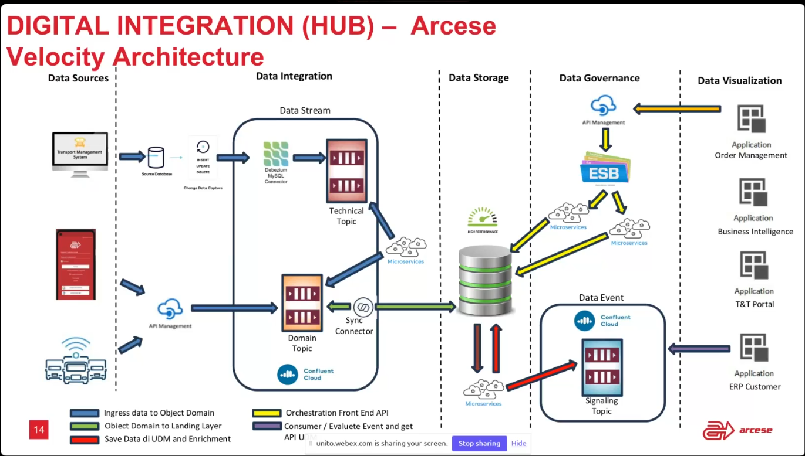

# overview
Lo scopo è costruire un T&T veloce. prima era 40 minuti, adesso è 3.
per fare ciò è tutto incentrato su kafka. Architettura cloud, appoggiandosi ad azure e pensata apposta per essere scalabile.
nella seguente slide è mostrato dove si colloca velocity all'interno del sistema.

TODO: chiedere a Massimo se è possibile avere la slide.
Velocity (quello che si vede documentato come "confluent cloud") lavora con input che arrivano dal TMS (transport management system), cioè con *Technical Events* oppure con input che arrivano dagli autisti dei camion tramte apposita app interna, cioè con *Business Events*.

nota che i tecnical events sono quelli che io ottengo da Debezium, 

# approfondimenti da modificare sulla tesi
Nella tesi a pagina 19 ho scritto:

Domain Events: Questi Topic contengono gli eventi filtrati dai Technical Events tramite i Kafka Streams

Non è vero, o almeno non completamente.
I domain events sono una combinazione di technical events filtrati dai kafka streams ed eventi generati dai camionisti con l'app interna.

Invece i Business Event (che vivono nel signaling topic) sono sempre e solo gli eventi generati dai kafka streams. I Domain Events escono, passano attraverso il kafka stream, vengo scritti nel Fast Storage. Dal fast storage vengono letti e scritti nel signaling topic in base ad altri microservizi che fanno altro.
Fanno altro cosa? di base osservano le modifiche al fast storage e arrichiscono ed unificano le informazioni che arrivano dal domain topic.
Ad esempio un oggetto di dominio "consegna" porta con se diversi eventi di business: l'aggiornamento della geolocalizzazione dell'ordine ad esso associato, la notifica dell'avvenuta consegna al cliente, etc ...
Basandosi su quanto scritto nel Fast Storage, che è stato scritto in base ai Domain Events precedentemente giunti al Domain Topic, i microservizi che osservano il Fast Storage generano Business Events.

sempre pagina 19 della tesi:
aggiungere rifuardo ai Business Event:
Al posto di addossare ad un sistema monolitico la responsabilità di comunicare i Business Event direttamente ai clienti, con le difficoltà che ciò comporterebbe (ad esempio la necessità di grosse modifiche al sistema per aggiungere un nuovo tipo di Business Event), si è scelto di utilizzare un Kafka Topic su cui scrivere i Business Event. 
Il Signaling Topic è ascoltato da diversi microservizi che possono vedere tutti gli eventi, ma processano solo quelli a cui sono interessati e si preoccupano di inoltrarli ai clienti.
I Business Events devono essere strutturati in maniera da permettere ai vari consumer di decidere se l'evento è di loro interesse o meno.
Questi eventi perciò contengono 3 principali informazioni:
- tipo di evento: spedizione, ritiro, viaggio, disposizione o ordine FTL (Full Truck Load)
- quali oggetti nel datamodel sono stati modificati. Ciò corrisponde a speficare quali tabelle all'interno del fast storage sono state interessate dal Domain Event.
- quali "campi sensibili" sono stati modificati. I campi sensibili sono quei campi che, se modificati, possono interessare il consumer dell'evento. Ad esempio, se un ordine cambia data di consegna, il consumer potrebbe essere molto interessato a questa informazione.

Aggiungere alla tesi nel capitolo di Event Export dove questo microservizio si posiziona all'interno del sistema (cioè legge dal signaling topic e dal fast storage e scrive sul fast storage (ed invia le mail)).

# vecchio T&T (fatto)
Lo scopo del sistema di T&T è quello di fornire al cliente tracciabilità sugli ordini da lui effettuati.

Al momento ci sono due sistemi di T&T, uno alimentato da velocity, l'altro completamente indipendente.
La creazione di ordini e le richieste dei clinenti giungono in entrambi i casi tramite il TMS. 
Il TMS di suo genera degli eventi (non intesi come eventi kafka, ma come eventi di business) che vengono scritti in un suo db (quello che poi velocity monitora tramite debezium).
Però il TMS non genera tutti gli eventi che servono, nasce quindi la necessità di avere un software che calcoli questi eventi mancanti, partendo da quelli che il TMS genera (ed anche da quelli generati dall' applicazione che i camionisti hanno, ma questa applicazione quando il T&T è stato creato in orgine non esisteva).
Esempio concreto: il TMS genera l'evento "ordine creato", ma non genera l'evento "ordine spedito", genera invece l'evento "camion partito". Andando ad analizzare quali sono gli ordini che sono stati caricati sul camion, il T&T è in grado di generare l'evento "ordine spedito" per ognuno di essi.
Prima il sistema era un software monolitico che gestiva tutto, basato su batching e non orientato ad eventi.

L'idea era smontare il vecchio sistema monolitico e renderlo basato su microservizi ed ad eventi.
I vantaggi di creare un sistema orientato ad eventi sono due:
- il sistema reagisce prontamente agli eventi, senza dover aspettare che un batch venga eseguito.
- il sistema intercetta tutti gli eventi, anche quelli intermedi. Ad esempio se un ordine viene creato e poi annullato, il sistema monolitico non si accorge di nulla, se queste due operazioni avvengono nell'intervallo tra l'esecuzione di una batch e l'altra. 
Quindi sono state prese alcune funzioni del vecchio sistema e le si sono spostate in un nuovo sistema (Velocity) basato su eventi.
Altre fuzionalità sono invece rimaste in un'altro sistema, che attinge da Velocity e svolge le restanti funzioni del T&T.

Velocity presenta una limitazione, deve interfacciarsi con i vecchio sistemi, sia in input che in output.
L'input arriva dal sistema TMS e viene quindi usato Debezium per leggere dal suo db.
In output invece il problema è che Velocity non implementa tutte le funzionalità del vecchio sistema, ma solo una parte.
In particolare la fase finale di comunicazione con i clienti (invio di email, aggiornamento del portale web, etc..) non è implementata in Velocity. 
per questo come affermavo prima ci sono due sistemi di T&T, uno alimentato da velocity, l'altro completamente indipendente.
Il nuovo T&T (quello alimentato da velocity) è completamente identico al vecchio T&T, ma senza le feature che adesso sono gestite da Velocity
perciò si aspetta di trovare i dati in un certo modo, quindi Velocity deve essere in grado di scrivere i dati nello stesso modo in cui li scriveva il vecchio sistema. Ciò viene risolto con diverse operazioni di mapping implementate nei Kafka Streams e nei vari microservizi.  

I due sistemi T&T sono sviluppati i .NET, il vecchio è un servizio windows che gira su un server virtuale, il nuovo è una Azure function (simili alle AWS lambda), quindi su cloud in ascolto sui topic di Kafka.
# lo aggiungo o no? 
c'è tutto un capitolo che potrei scrivere riguardo a Quartz, al problema della consistenza ed al punctator. Ma sinceramente mi sembra ci sia già abbastanza roba nella tesi. Magari si può aggiungere solo nella tesi cartacea.